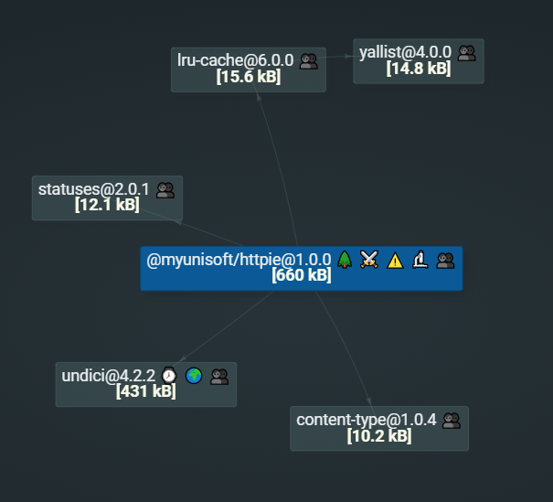

# Httpie

A modern and light Node.js http client 🐢🚀. The package is inspired by lukeed [httpie](https://github.com/lukeed/httpie) (The use is relatively similar). This package use new Node.js http client [undici](https://github.com/nodejs/undici) under the hood.

## Features

- Automatically handles JSON requests and responses.
- Includes aliases for common HTTP verbs: `get`, `post`, `put`, `patch`, and `del`.
- Able to automatically detect domains and paths to assign the right Agent (use a LRU cache to avoid repetitive computation).
- Allows to use an accurate rate-limiter like `p-ratelimit`.
- Built-in retry mechanism with **custom policies**.

Thanks to undici:

- Support [HTTP redirections](https://developer.mozilla.org/en-US/docs/Web/HTTP/Redirections) with the `maxRedirections` argument.
- Implement high-level API for undici **stream** and **pipeline** method.
- High performance (see [benchmarks](https://undici.nodejs.org/#/?id=benchmarks)).
- Work well with **newest** Node.js API [AbortController](https://nodejs.org/dist/latest-v16.x/docs/api/globals.html#globals_class_abortcontroller) to cancel http request.

Light with seriously maintained dependencies:



## Requirements
- [Node.js](https://nodejs.org/en/) version 14 or higher

## Getting Started

This package is available in the Node Package Repository and can be easily installed with [npm](https://docs.npmjs.com/getting-started/what-is-npm) or [yarn](https://yarnpkg.com).

```bash
$ npm i @myunisoft/httpie
# or
$ yarn add @myunisoft/httpie
```

## Usage example

The MyUnisoft httpie client is very similar to lukeed httpie http client.

```js
import * as httpie from "@myunisoft/httpie";

try {
  const { data } = await httpie.get("https://jsonplaceholder.typicode.com/posts");
  console.log(data);
  
  const response = await httpie.post("https://jsonplaceholder.typicode.com/posts", {
    body: {
      title: "foo",
      body: "bar",
      userId: 1
    }
  });

  console.log(response.statusCode);
  console.log(response.statusMessage);
  console.log(response.data);
}
catch (error) {
  console.log(error.message);
  console.log(error.statusCode);
  console.log(error.headers);
  console.log(error.data);
}
```

## API

- [Request API](./docs/request.md)
- [Work and manage Agents](./docs/agents.md)
